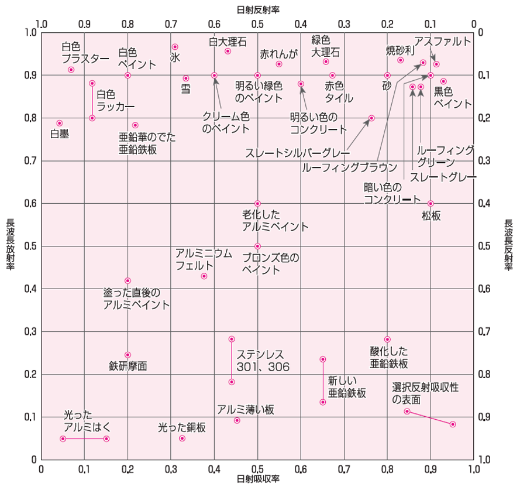
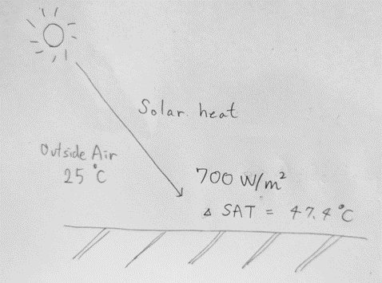

.. |m2| replace:: m\ :sup:`2` \

******************************************************************
Eqivalent Outside Air Temperature Simulation Tool (EOATST)
******************************************************************

Introduction
============

This tool provides the calculation of the eqivalent outside air temperature(SAT: sol-air temperature).
The eqivalent outside air temperature is the outside temperature considering the solar heat absorption of the external envelope surface.
This value depends on the outside air temperature, solar radiation on the surface, outside surface thermal resistance and sola absorption ratio.
This value is very important index for calculating solar heag gain through the opaque envelope such as roof, ceiling, wall, especially when simulating the heat gain through the envelope from the outside into the inside in cooling season.

本ツールは等価外気温度（SAT）の計算を提供します。
等価外気温度は外皮の外気側表面における日射熱吸収を考慮した外気温度です。
この値は外気温度、表面の日射量、外気側表面の熱伝達抵抗、そして日射熱吸収率に依存します。
この値は、屋根、天井、壁といった不透明な外皮を通じた日射熱取得、特に、冷房期に室外から室内に外皮を通じて流入する熱を計算する際に非常に重要な指標となります。

How to Use
==================

Input

- Outside temperature, degree C
- Solar radiation, W / |m2|
- Outside surface thermal resistane, |m2| K / W
- Solar heat absorption ratio, -

入力

- 外気温度, ℃
- 日射量, W / |m2|
- 外気側表面熱伝達抵抗, |m2| K / W
- 日射吸収率, -

For example, solar radiation is here:

例えば、日射量は以下で表されます。

.. csv-table:: Solar Heat Gain Example
   :header: "Type", "Value"
   :widths: 15, 15

   "Very Sunny", 1000
   "Sunny", 700
   "Cloudy", 300
   "Rainy", 150

Outside surface thermal resistance depends much on the wind speed on the surface and the direction of the heat flux.
In Japanese Energy Efficiency Standard, this value is decided to equals to be 0.04 |m2| K / W.

外気側表面熱伝達抵抗は表面における風速と熱の移動する方向に大きく依存します。
日本の省エネルギー基準では、この値は 0.04 |m2| K / W と決められています。

Solar absorption ratio depends on the type of the material, especially on the surface colar.
An example is shown below.

日射吸収率は、部材の種類、特にその表面の色に依存します。
以下に例を示します。

    Short and Long Wave Length Absorption and Reflection Ratio on Material Surface

| 出典：建築環境・省エネルギー機構：自立循環型住宅への設計ガイドライン　蒸暑地版
| 参考：「設計資料集成1 環境」（p.122） 日本建築学会 丸善 1978年 をもとに作成

Image
============

    SAT Image

Description
=======================

The equivalent outside temperature is calculated by:

等価外気温度は以下のように計算されます。

.. math::
  \theta_{SAT} = \theta_o + J \times a \times R_o

:math:`\theta_{SAT}`
  | Equivalent outside temperature, degree C
  | 等価外気温度, ℃
:math:`\theta_o`
  | Outside temperature, degree C
  | 外気温度, ℃
:math:`J`
  | Solr radiation on the surface ( direct and sky radiation ), W / |m2|
  | 表面の日射量（直達日射と天空日射), W / |m2|
:math:`a`
  | Solar absoption ratio, -
  | 日射吸収率, －
:math:`R_o`
  | Outside surface thermal resistance, |m2| K / W
  | 室外側表面熱伝達抵抗, |m2| K / W

Derivation
============

No description.
